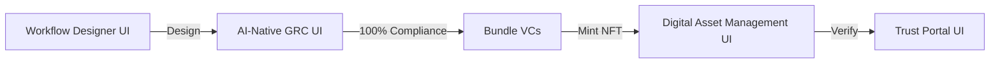

# ZeroH Architecture Session Findings
**Date**: 2025-11-07
**Status**: Architecture Planning Complete
**Context**: Alignment of Workflow Designer (Steps 0-10) with AI-Native GRC Dashboard (5-Bucket Taxonomy)

---

## Executive Summary

This session completed the **microservice architecture blueprint** and defined the **configuration mapping logic** that connects the Workflow Designer to the GRC Dashboard. Key findings:

1. **4 Frontend UIs Identified** (not 3):
   - Workflow Designer (Steps 0-10) - Design deals
   - AI-Native GRC Dashboard (6 screens) - Monitor compliance
   - Trust Portal - External stakeholder view
   - **Digital Asset Management UI** - Portfolio & trading NFT certificates (NEW)

2. **12 Minimum Questions** required to properly activate all 26 controls across 5 buckets

3. **AG-UI Protocol Alignment**: Workflow should be conversational, not 10 separate form steps

4. **Tokenization Clarity**: VCs = Proof Tokens (current), NFTs = Asset Tokens (future)

---

## Key Architectural Decisions

### 1. Four Frontend UIs (Not Three)



**Digital Asset Management UI** (NEW discovery):
- **Purpose**: Manage tokenized assets (NFT certificates) after 100% compliance
- **Features**: Portfolio dashboard, asset detail view, secondary market, compliance verification, transfer/freeze/burn
- **Users**: Asset holders, portfolio managers, traders
- **Why Separate from GRC**: Different personas (investors vs compliance officers), different data sources (HTS vs Control Engine)

### 2. Tokenization Architecture

**Two Meanings of "Tokenization"**:

1. **Proof Tokenization** (Current Implementation)
   - Control execution → Passes → Mint VC (Proof Token) → Anchor to Hedera HCS
   - 25 controls → 25 VCs → Bundle = Complete Proof
   - VCs are "tokens of proof" - cryptographic evidence of compliance

2. **Asset Tokenization** (Future Feature)
   - Bundled VCs (100% compliance) → Mint NFT Certificate → Hedera HTS
   - NFT metadata references VC bundle hash
   - Enables secondary market trading
   - NFTs are "tokens of ownership" - tradable securities

**Key Insight**: Asset tokenization (NFT) **REQUIRES** proof tokenization (VCs) as prerequisite. You cannot tokenize an asset that hasn't proven compliance.

### 3. Microservice Architecture (8 Services)

1. **Workflow Designer Service** - Compose Guardian policies
2. **Control Engine Service** - Execute 26 controls with Rego
3. **Agent Orchestration Service** - Coordinate AI agents with AG-UI
4. **Evidence Vault Service** - Manage compliance artifacts
5. **Proof Layer Service** - Mint VCs, anchor to HCS
6. **Asset Tokenization Service** (Future) - Mint NFTs on HTS
7. **Dashboard Generator Service** - Auto-generate KRI dashboards
8. **Trust Portal Service** - External stakeholder view

**Why Microservices**:
- Independent scaling (Control Engine ≠ Dashboard Generator)
- Technology flexibility (Python for policy, Node for real-time)
- Team autonomy (Frontend ≠ Backend)
- Fault isolation
- UI swappability (GraphQL API)

### 4. Configuration Mapping Logic: 12 Minimum Questions

**The Problem**: Current 4-component model (Shariah Structure, Jurisdiction, Accounting, Impact) insufficient to activate all 26 controls across 5 buckets.

**The Solution**: 12-Question Minimum Viable Questionnaire (MVQ):

**Domain 1: Product & Structure** (3 questions)
- Q1: Product Type (Sukuk, Murabaha, Ijara, etc.)
- Q2: Sustainability Overlay (None, GBP, SBP, SLB) ← CRITICAL for Bucket 4
- Q3: Deal Complexity (Simple, Medium, Complex)

**Domain 2: Jurisdiction & Regulatory** (3 questions)
- Q4: Primary Jurisdiction (Malaysia, UAE, Saudi, etc.)
- Q5: Cross-Border Exposure (No, Investor base, Asset location)
- Q6: Listing Status (Private, Public)

**Domain 3: Risk Profile** (2 questions)
- Q7: Counterparty Risk Exposure (Low, Medium, High)
- Q8: Liquidity & Funding Model (Fixed maturity, IAH, Credit line)

**Domain 4: Governance & Assurance** (3 questions)
- Q9: Shariah Governance Maturity (Full SSB+Review+Audit, SSB+Review, SSB only)
- Q10: Internal Audit Capability (Yes in-house, Yes outsourced, No)
- Q11: External Audit Requirement (Yes regulatory, Yes voluntary, No)

**Domain 5: Accounting & Reporting** (1 question)
- Q12: Accounting Framework (AAOIFI, IFRS, Local GAAP, Hybrid)

**Control Activation Range**:
- **Minimum**: 12 controls (simple bilateral Murabaha, no sustainability, minimal governance)
- **Maximum**: 26 controls (complex Sukuk, SLB, full governance, cross-border, listed)

### 5. AG-UI Protocol Alignment (CRITICAL FINDING)

**User Feedback**: *"We don't need to have 10 steps, in fact we should reduce steps where possible as this is a AG-UI protocol aligned UI that doesn't need to adhere to traditional cluttered dashboard with navigation nightmare problems"*

**Implication**: Workflow Designer should NOT be 10 separate form steps. Instead:

**Conversational Flow** (Recommended):
```
Step 0: Overview
  ↓
Step 1: Agent-Guided Configuration
  • Agent: "Tell me about your deal. I'll ask clarifying questions."
  • User: "We're structuring a $500M Sukuk for renewable energy in Malaysia"
  • Agent: [Asks 12 questions conversationally, not as forms]
  • Agent: "Based on your answers, I've activated 21 controls across 5 buckets"
  ↓
Step 2: Review & Confirm
  • Show: Control activation matrix, Guardian policy preview
  • User: Approve → Deal created
  ↓
Step 3: Navigate to GRC Dashboard (/ai-native/deals/:dealId)
```

**Benefits**:
- Fewer explicit steps (3 instead of 10)
- More natural interaction (conversation vs forms)
- Agent can adaptively ask follow-up questions
- Progressive disclosure (only ask what's needed)
- AG-UI streaming (real-time feedback)

**Implementation**:
- Replace Steps 2-10 with single conversational interface
- Use AG-UI `message` and `tool_call` events
- Agent uses `activateControls()` function to determine configuration
- Show control activation in real-time as user answers

### 6. Control Activation Matrix (26 Controls × 12 Questions)

**Bucket 1: Shariah Governance** (5 controls)
- SG-01: SSB Mandate (ALL deals) → Activated by Q1, Q9
- SG-02: Shariah Review → Activated by Q9 (if not "SSB only")
- SG-03: Shariah Risk Management (ALL) → Activated by Q9
- SG-04: Shariah Audit → Activated by Q9 (if "Full")
- SG-05: SNC Handling (ALL) → Activated by Q9

**Bucket 2: Regulatory & Legal** (5 controls)
- RL-01: Licensing (ALL) → Activated by Q4
- RL-02: AML/CFT (ALL) → Activated by Q4
- RL-03: Data Protection → Activated by Q5 (if cross-border with investors)
- RL-04: Securities & Trustee → Activated by Q4, Q6 (if listed)
- RL-05: Cross-Border Mapping → Activated by Q5 (if Yes)

**Bucket 3: Risk Management** (5 controls)
- RM-01: Credit Risk → Activated by Q7 (if not Low)
- RM-02: Operational Risk → Activated by Q3 (if not Simple)
- RM-03: Liquidity & RoR → Activated by Q8 (if IAH)
- RM-04: Displaced Commercial Risk → Activated by Q8 (if IAH)
- RM-05: SNC & Equity Risk → Activated by Q1 (if Musharaka/Mudaraba)

**Bucket 4: Financial & Reporting** (6 controls)
- FR-01: Financials (ALL) → Activated by Q1, Q12
- FR-02: Profit Recognition (ALL) → Activated by Q1, Q12
- FR-03: SPV Segregation → Activated by Q1 (if Sukuk)
- FR-04: Use-of-Proceeds Ledger → Activated by Q2 (if GBP/SBP)
- FR-05: KPI Monitoring → Activated by Q2 (if GBP/SBP/SLB) ← MANDATORY for SLB
- FR-06: Post-Issuance Reporting → Activated by Q2, Q12 (if sustainability)

**Bucket 5: Audit & Assurance** (5 controls)
- AA-01: Internal Audit → Activated by Q10 (if Yes)
- AA-02: Shariah Audit → Activated by Q9 (if "Full")
- AA-03: External Audit → Activated by Q11 (if Yes)
- AA-04: Sustainability Assurance → Activated by Q2 (if GBP/SBP/SLB)
- AA-05: Regulator Inspection (ALL) → Always activated

**Critical Dependencies**:
- SLB (Sustainability-Linked Bond) → MUST activate FR-05 (annual KPI verification per ICMA SLBP 2020)
- IAH funding → MUST activate RM-03, RM-04 (RoR and DCR risks per IFSB-1)
- Cross-border with EU investors → MUST activate RL-03 (GDPR compliance)

### 7. GRC Dashboard Bucket Score Calculation

**Key Principle**: Bucket scores calculated based ONLY on activated controls (not all 26).

```typescript
function calculateBucketScore(bucketId: number, deal: Deal): number {
  const activatedControls = deal.applicableControls.filter(c => c.bucket === bucketId)
  const passedControls = activatedControls.filter(c => c.status === 'passed')
  return (passedControls.length / activatedControls.length) * 100
}
```

**Example**: Simple Murabaha deal
- Only 12/26 controls activated
- Bucket 1: 3/5 controls activated → 100% = 3 passed / 3 activated
- Bucket 2: 2/5 controls activated → 100% = 2 passed / 2 activated
- Overall: 100% compliance = 12 passed / 12 applicable (NOT 12/26)

**Implication**: GRC Dashboard MUST show only applicable controls per deal, not all 26.

---

## Implementation Priority

### Phase 1: Architecture Foundation (Week 1-2)
- [ ] Define GraphQL schema for all 7 services
- [ ] Create Docker Compose dev environment
- [ ] Implement API Gateway (Kong)
- [ ] Update high-level architecture diagram with 4 UIs

### Phase 2: Configuration Logic (Week 3-4)
- [ ] Implement 12-Question MVQ in Workflow Designer
- [ ] Build `activateControls()` function with activation matrix
- [ ] Create conversational agent for configuration (replace Steps 2-10)
- [ ] Store `DealConfiguration` with answers + derived controls

### Phase 3: Core Services (Week 5-7)
- [ ] Implement Control Engine with Rego
- [ ] Build Agent Orchestration with Claude SDK
- [ ] Create Proof Layer with Hedera Guardian MCP
- [ ] Develop Dashboard Generator with dynamic bucket scoring

### Phase 4: Digital Asset Management UI (Week 8-10)
- [ ] Design Portfolio Dashboard mockups
- [ ] Build Asset Detail View
- [ ] Integrate with Hedera HTS (future)
- [ ] Add secondary market functionality

---

## Key Artifacts Created

1. **MICROSERVICE_ARCHITECTURE_BLUEPRINT.md** (1500+ lines)
   - Complete 8-service architecture with API contracts
   - VC → NFT tokenization pipeline
   - Digital Asset Management UI specification
   - Mermaid diagrams for system architecture
   - Sequence diagrams for data flows

2. **Workflow Designer → GRC Alignment Section**
   - 12-Question MVQ with activation logic
   - Control Activation Matrix (26 × 12)
   - TypeScript implementation for `activateControls()`
   - UI/UX flow recommendations

3. **Architecture Diagrams**
   - High-level system architecture (4 layers, 8 services, 4 UIs)
   - Sequence diagram for Sukuk deal creation (end-to-end)
   - VC → NFT tokenization pipeline
   - Digital Asset Management UI architecture

---

## Open Questions / Next Steps

### 1. AG-UI Conversational Flow Implementation
**Question**: How to implement the conversational workflow configuration?
**Options**:
- A) Single-page chat interface with streaming responses
- B) Multi-step wizard with agent guidance at each step
- C) Hybrid: Chat for initial discovery, form for final confirmation

**Recommendation**: Option A (single-page chat)
- Aligns with AG-UI protocol
- Reduces navigation complexity
- Enables adaptive questioning
- Real-time control activation feedback

### 2. Guardian Policy Composition
**Question**: How does Guardian accept dynamic policies based on activated controls?
**Investigation Needed**:
- Guardian API for policy CRUD
- Policy template structure
- How to compose policy from control subset
- Policy versioning and updates

### 3. Deal Configuration Versioning
**Question**: What happens when user changes deal configuration post-creation?
**Scenarios**:
- User adds sustainability overlay (SLB) → activates FR-04, FR-05, FR-06, AA-04
- User changes governance maturity → deactivates SG-04, AA-02
**Implications**:
- Control re-evaluation required
- VCs already minted remain valid or need revocation?
- Dashboard bucket scores recalculate

### 4. Control Library Maintenance
**Question**: How to update Control Library without breaking existing deals?
**Approach**:
- Version control library (v1, v2, etc.)
- Deals reference specific version
- Backward compatibility for VCs
- Migration path for deals to adopt new controls

### 5. Selective Disclosure Rules
**Question**: What fields should be visible to which roles in VCs?
**Roles**:
- Customer: Compliance status only
- Regulator: Full control details except sensitive commercial data
- Auditor: Full control details + evidence
- Public: Minimal disclosure (Trust Portal)

---

## Standards Alignment Summary

### IFSB (Islamic Financial Services Board)
- **IFSB-1**: Risk management principles (RoR, DCR, SNC risks) → RM bucket
- **IFSB-10**: Shariah governance → SG bucket
- **IFSB-12**: Liquidity risk → RM-03

### AAOIFI (Accounting and Auditing Organization for Islamic Financial Institutions)
- **GS-1**: SSB mandate → SG-01
- **GS-2**: Shariah review → SG-02
- **GS-3/GS-11**: Shariah audit → SG-04, AA-02
- **FAS 4/7/28/33**: Financial reporting → FR-01, FR-02

### BNM (Bank Negara Malaysia)
- **Shariah Governance Policy (2019)**: → SG bucket
- **VBIAF (Value-Based Intermediation)**: Sustainability framework → FR bucket

### ICMA (International Capital Market Association)
- **GBP/SBP (Green/Social Bond Principles)**: Use-of-proceeds → FR-04
- **SLBP (Sustainability-Linked Bond Principles)**: KPI verification → FR-05 (MANDATORY annual)
- **External Review Guidelines**: → AA-04

### FATF (Financial Action Task Force)
- **40 Recommendations (2025)**: AML/CFT → RL-02

---

## Document Control

| Version | Date | Author | Changes |
|---------|------|--------|---------|
| 1.0 | 2025-11-07 | Claude | Initial findings from architecture session |

---

**END OF FINDINGS DOCUMENT**

This document captures all key architectural decisions and findings from the microservice architecture planning session. Use this as reference for implementation.
