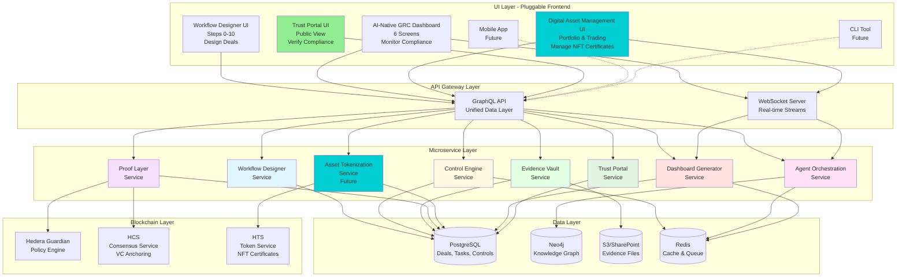
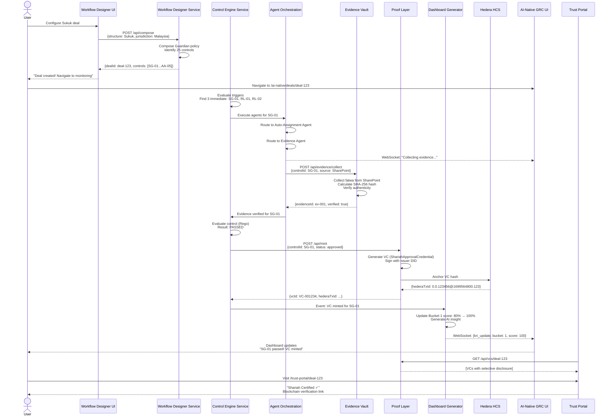
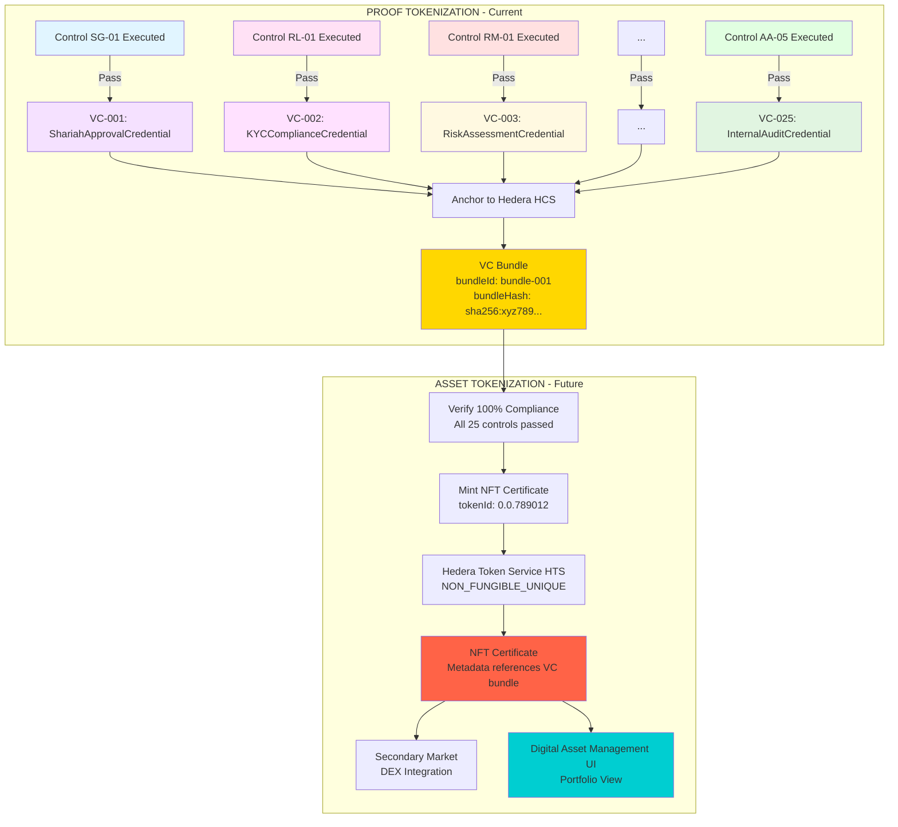
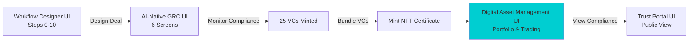
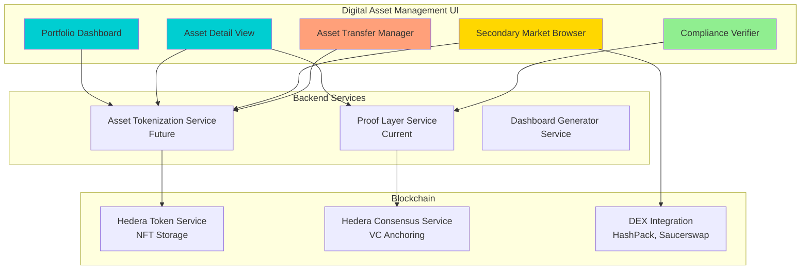

# ZeroH Platform - Microservice Architecture Blueprint

**Version**: 1.0
**Date**: 2025-11-07
**Purpose**: Separation of concerns for UI/UX-agnostic platform implementation
**Status**: Architecture Documentation

---

## Executive Summary

This document defines the microservice architecture for ZeroH, enabling **separation between workflow design and compliance execution**, and clarifying where **tokenization** fits in the context of **Verifiable Credentials as proof tokens**.

### Key Architectural Insights

1. **Two Distinct Workflows**:
   - **Workflow Design** (Steps 0-10): User composes Guardian policy from 4 components
   - **Workflow Execution** (AI-Native GRC): System executes 25 controls with AI agents

2. **VCs Are Proof Tokens**:
   - Each passed control → mints a Verifiable Credential
   - VCs are "tokens of proof" anchored to Hedera blockchain
   - Bundled VCs = comprehensive compliance proof for a deal
   - **This IS the "tokenization"** that exists now

3. **Asset Tokenization** (Future):
   - Takes bundled VCs as input
   - Mints NFT certificate representing deal ownership
   - NFT metadata references VCs as compliance proof
   - Enables secondary market trading

4. **Microservice Ethos**:
   - Each service has single responsibility
   - Services communicate via well-defined APIs
   - UI can be swapped without changing backend
   - Configuration-driven, not hard-coded

---

## Architecture Overview

### High-Level System Architecture



### ASCII Architecture (Alternative View)

```
┌─────────────────────────────────────────────────────────────────┐
│                        USER INTERFACE LAYER                      │
│                      (Pluggable Frontend)                        │
│  ┌───────────────────────┐  ┌───────────────────────────────┐  │
│  │ Workflow Designer UI  │  │  AI-Native GRC Dashboard      │  │
│  │ (Steps 0-10)          │  │  (6 screens)                  │  │
│  └───────────────────────┘  └───────────────────────────────┘  │
└─────────────────────────────────────────────────────────────────┘
                               ↕ REST API + WebSocket
┌─────────────────────────────────────────────────────────────────┐
│                      MICROSERVICE LAYER                          │
│  ┌──────────────┐ ┌──────────────┐ ┌──────────────┐            │
│  │  Workflow    │ │   Control    │ │    Agent     │            │
│  │  Designer    │ │   Engine     │ │Orchestration │            │
│  │  Service     │ │   Service    │ │   Service    │            │
│  └──────────────┘ └──────────────┘ └──────────────┘            │
│  ┌──────────────┐ ┌──────────────┐ ┌──────────────┐            │
│  │  Evidence    │ │    Proof     │ │  Dashboard   │            │
│  │    Vault     │ │    Layer     │ │  Generator   │            │
│  │   Service    │ │   Service    │ │   Service    │            │
│  └──────────────┘ └──────────────┘ └──────────────┘            │
│  ┌──────────────┐                                               │
│  │Trust Portal  │                                               │
│  │   Service    │                                               │
│  └──────────────┘                                               │
└─────────────────────────────────────────────────────────────────┘
                               ↕
┌─────────────────────────────────────────────────────────────────┐
│                         DATA LAYER                               │
│  ┌──────────────┐ ┌──────────────┐ ┌──────────────┐            │
│  │ PostgreSQL   │ │    Neo4j     │ │     S3/      │            │
│  │  (Deals,     │ │ (Knowledge   │ │  SharePoint  │            │
│  │   Tasks,     │ │   Graph)     │ │  (Evidence)  │            │
│  │   Controls)  │ │              │ │              │            │
│  └──────────────┘ └──────────────┘ └──────────────┘            │
└─────────────────────────────────────────────────────────────────┘
                               ↕
┌─────────────────────────────────────────────────────────────────┐
│                    BLOCKCHAIN LAYER                              │
│              Hedera Guardian + HCS + HTS                         │
└─────────────────────────────────────────────────────────────────┘
```

---

## Service Specifications

### Service 1: Workflow Designer

**Purpose**: Enable users to compose Islamic finance product workflows from modular components

**Responsibilities**:
- Present 4-component selection interface (Shariah, Jurisdiction, Accounting, Impact)
- Compose Guardian policy from user selections
- Generate initial control checklist for new deal
- Validate configuration compatibility
- Create deal specification

**API Contract**:
```typescript
// POST /api/workflow-designer/compose
interface ComposeWorkflowRequest {
  shariahStructure: 'Ijara' | 'Murabaha' | 'Musharaka' | 'Mudaraba' | 'Sukuk' | 'Istisna'
  sukukSecuritization?: boolean
  takafulOverlay?: { enabled: boolean, model?: string }
  jurisdiction: string
  accountingFramework: 'AAOIFI' | 'IFRS' | 'Local GAAP'
  impactMetrics: string
  dealMetadata: {
    dealName: string
    issuer: string
    amount: number
    currency: string
    maturityDate: string
  }
}

interface ComposeWorkflowResponse {
  dealId: string
  dealSpecification: {
    productType: string
    components: {
      shariah: { structure: string, standards: string[] }
      jurisdiction: { country: string, regulations: string[] }
      accounting: { framework: string, standards: string[] }
      impact: { framework: string, metrics: string[] }
    }
    applicableControls: string[]  // Control IDs from Control Library
    guardianPolicy: {
      policyId: string
      steps: GuardianPolicyStep[]
    }
  }
  nextActions: {
    route: '/ai-native/deals/:dealId'
    message: 'Deal created. Begin compliance monitoring.'
  }
}
```

**Technology Stack**:
- Language: TypeScript/Node.js
- Framework: Express or Fastify
- Dependencies: Guardian Policy SDK

**Integration Points**:
- **→ Control Engine**: Sends deal specification with applicable controls
- **→ Dashboard Generator**: Triggers initial dashboard setup
- **← Control Library**: Reads control requirements per product type

---

### Service 2: Control Engine

**Purpose**: Execute governance controls based on Control Library configuration

**Responsibilities**:
- Load Control Library (25-26 controls)
- Evaluate control trigger conditions (event-driven, periodic, etc.)
- Execute control logic (Rego rules)
- Track Key Risk Indicators (KRIs)
- Generate remediation tasks on control failure
- Update deal compliance scores

**API Contract**:
```typescript
// POST /api/control-engine/evaluate
interface EvaluateControlRequest {
  controlId: string  // e.g., "SG-01"
  dealId: string
  context: {
    evidenceIds?: string[]
    executionData?: Record<string, any>
  }
}

interface EvaluateControlResponse {
  controlId: string
  status: 'passed' | 'failed' | 'conditional' | 'in_progress'
  result: {
    kri: number
    threshold: number
    pass: boolean
  }
  requiredEvidence: Array<{
    evidenceName: string
    status: 'verified' | 'missing' | 'stale'
  }>
  nextActions: {
    mintVC?: boolean
    createTask?: { taskId: string, assignee: string }
    alertOwner?: boolean
  }
}

// GET /api/control-engine/triggers
interface GetTriggersResponse {
  triggeredControls: Array<{
    controlId: string
    dealId: string
    triggerReason: string
    dueDate: string
    priority: 'critical' | 'high' | 'medium' | 'low'
  }>
}
```

**Technology Stack**:
- Language: Python
- Policy Engine: Rego (Open Policy Agent)
- Database: PostgreSQL (control execution log)
- Queue: Redis (trigger scheduling)

**Integration Points**:
- **→ Agent Orchestration**: Triggers evidence collection, drift detection
- **→ Proof Layer**: Sends passed control data for VC minting
- **→ Dashboard Generator**: Sends KRI updates
- **← Evidence Vault**: Requests evidence verification
- **← Control Library**: Reads control definitions

---

### Service 3: Agent Orchestration

**Purpose**: Coordinate AI agent execution for automated compliance tasks

**Responsibilities**:
- Route control triggers to appropriate agents
- Stream AG-UI events to frontend (message, status, typing, tool_call)
- Execute agent behaviors (collect evidence, detect drift, assign tasks)
- Human-in-the-loop checkpoints
- Manage agent context and state

**API Contract**:
```typescript
// POST /api/agents/execute
interface ExecuteAgentRequest {
  agentId: 'compliance-copilot' | 'evidence-agent' | 'drift-agent' | 'auto-assignment-agent' | 'blockchain-agent'
  action: {
    type: 'collect_evidence' | 'validate_control' | 'mint_vc' | 'detect_drift' | 'answer_query'
    controlId: string
    dealId?: string
    params: Record<string, any>
  }
}

interface ExecuteAgentResponse {
  executionId: string
  streamUrl: string  // WebSocket URL for AG-UI events
}

// WebSocket: /api/agents/stream/:executionId
interface AGUIEvent {
  type: 'message' | 'status' | 'typing' | 'tool_call' | 'state_update'
  agentId: string
  timestamp: string
  payload: any
}
```

**Technology Stack**:
- Language: Python
- AI: Claude 3.5 Sonnet (Anthropic)
- WebSocket: FastAPI + WebSocket
- Queue: Redis (agent task queue)

**Integration Points**:
- **→ Evidence Vault**: Requests evidence collection
- **→ Control Engine**: Reports control validation results
- **→ Proof Layer**: Requests VC minting
- **← Control Engine**: Receives control triggers

---

### Service 4: Evidence Vault

**Purpose**: Manage compliance evidence artifacts with versioning and verification

**Responsibilities**:
- Collect evidence from multiple sources (SharePoint, S3, APIs, Manual uploads)
- Verify evidence authenticity (hash, signature)
- Track evidence freshness and expiry
- Version evidence updates
- Associate evidence with controls and VCs

**API Contract**:
```typescript
// POST /api/evidence/collect
interface CollectEvidenceRequest {
  evidenceName: string
  source: 'SharePoint' | 'S3' | 'API' | 'Agent' | 'Manual' | 'Guardian'
  sourcePath?: string
  controlId: string
  dealId: string
  fileData?: {
    buffer: Buffer
    mimeType: string
    fileName: string
  }
}

interface CollectEvidenceResponse {
  evidenceId: string
  hash: string  // SHA-256
  verified: boolean
  url?: string
  collectedAt: string
}

// GET /api/evidence/by-control/:controlId
interface GetEvidenceResponse {
  evidence: Array<{
    evidenceId: string
    name: string
    source: string
    collectedAt: string
    verified: boolean
    hash: string
    stale: boolean
    expiryDate?: string
    vcId?: string
  }>
}
```

**Technology Stack**:
- Language: Python or Node.js
- Storage: S3 (files) + PostgreSQL (metadata)
- Connectors: SharePoint API, Guardian API, custom integrations

**Integration Points**:
- **→ Control Engine**: Sends verified evidence status
- **→ Proof Layer**: Provides evidence hashes for VC claims
- **← Agent Orchestration**: Receives collection requests

---

### Service 5: Proof Layer (VC Minting & Blockchain)

**Purpose**: Mint Verifiable Credentials and anchor to Hedera blockchain

**Responsibilities**:
- Generate VCs from control execution data using templates
- Sign VCs with issuer DID
- Submit VCs to Hedera Guardian
- Anchor VC hashes to Hedera Consensus Service (HCS)
- Track VC lifecycle (issued, expired, revoked)
- Enable selective disclosure (SD-JWT)

**API Contract**:
```typescript
// POST /api/proof-layer/mint
interface MintVCRequest {
  controlId: string
  dealId: string
  credentialSubject: {
    controlName: string
    bucketId: number
    status: 'approved' | 'rejected' | 'conditional'
    // Control-specific fields (varies by control)
    [key: string]: any
  }
  evidenceHashes: string[]
  selectiveDisclosureRules?: {
    role: string
    visibleFields: string[]
  }[]
}

interface MintVCResponse {
  vcId: string
  hederaTxId: string  // e.g., "0.0.123456@1699564800.123"
  vc: VerifiableCredential
  blockchainExplorerUrl: string  // HashScan link
}

// GET /api/proof-layer/vcs/by-deal/:dealId
interface GetVCsResponse {
  vcs: VerifiableCredential[]
  summary: {
    total: number
    approved: number
    conditional: number
    expired: number
  }
}

// POST /api/proof-layer/bundle
interface BundleVCsRequest {
  dealId: string
  includeControls: string[]  // Control IDs to include in bundle
}

interface BundleVCsResponse {
  bundleId: string
  bundleHash: string  // Hash of all VCs combined
  vcIds: string[]
  hederaTxId: string  // Bundle anchor TX
  complianceScore: number  // 0-100
}
```

**Technology Stack**:
- Language: Python
- DID: Hedera DID SDK
- Guardian: Hedera Guardian MCP
- HCS: Hedera Consensus Service SDK
- Database: PostgreSQL (VC registry)

**Integration Points**:
- **→ Dashboard Generator**: Sends VC minted events
- **→ Trust Portal**: Provides VCs for public display
- **← Control Engine**: Receives VC minting requests
- **← Evidence Vault**: Retrieves evidence hashes

---

### Service 6: Dashboard Generator

**Purpose**: Auto-generate real-time compliance dashboards from control KRIs

**Responsibilities**:
- Aggregate KRIs from Control Engine
- Calculate bucket scores (5-bucket taxonomy)
- Generate AI insights using control execution logs
- Predict compliance timeline
- Create action items (tasks needing attention)

**API Contract**:
```typescript
// GET /api/dashboard/config/:dealId
interface GetDashboardConfigResponse {
  overall: {
    complianceScore: number  // 0-100
    totalControls: number
    passedControls: number
    failedControls: number
    inProgressControls: number
  }
  buckets: Array<{
    bucketId: number
    bucketName: string
    score: number
    kris: Array<{
      controlId: string
      metric: string
      value: number
      target: number
      status: 'pass' | 'warning' | 'fail'
      trend: 'up' | 'down' | 'stable'
    }>
    insights: string[]  // AI-generated insights
    actions: Array<{
      label: string
      route: string
      count?: number
    }>
  }>
  prediction?: {
    projectedCompletionDate: string
    currentPace: string
    bottleneck: string
    confidence: number
  }
}

// WebSocket: /api/dashboard/stream/:dealId
interface DashboardUpdateEvent {
  type: 'kri_update' | 'control_passed' | 'vc_minted' | 'drift_detected'
  timestamp: string
  data: any
}
```

**Technology Stack**:
- Language: TypeScript/Node.js or Python
- AI: Claude (for insight generation)
- Database: PostgreSQL + Redis (caching)
- WebSocket: Socket.io or FastAPI WebSocket

**Integration Points**:
- **← Control Engine**: Receives KRI updates
- **← Proof Layer**: Receives VC minted events
- **→ Frontend**: Streams dashboard updates via WebSocket

---

### Service 7: Trust Portal

**Purpose**: Provide external stakeholder view of compliance with proof-constrained AI

**Responsibilities**:
- Display VCs with role-based selective disclosure
- Implement proof-constrained AI chatbot (only answers from VCs)
- Generate compliance badges for customer-facing pages
- Provide blockchain verification links
- Create shareable compliance reports

**API Contract**:
```typescript
// GET /api/trust-portal/deal/:dealId
interface GetTrustPortalDataRequest {
  viewerRole: 'customer' | 'regulator' | 'auditor' | 'public'
}

interface GetTrustPortalDataResponse {
  dealSummary: {
    dealId: string
    dealName: string
    complianceScore: number
    lastUpdated: string
  }
  visibleVCs: Array<{
    vcId: string
    controlId: string
    controlName: string
    status: 'approved' | 'conditional'
    issuanceDate: string
    hederaTxId: string
    // Only fields visible to this role
    credentialSubject: Partial<VerifiableCredential['credentialSubject']>
  }>
  complianceBadges: Array<{
    category: string
    status: 'compliant' | 'partial' | 'non_compliant'
    description: string
  }>
}

// POST /api/trust-portal/chat
interface ChatWithProofConstraintRequest {
  dealId: string
  query: string
  viewerRole: string
}

interface ChatWithProofConstraintResponse {
  answer: string
  citations: Array<{
    vcId: string
    controlId: string
    claimText: string
    hederaTxId: string
  }>
  confidence: number
}
```

**Technology Stack**:
- Language: TypeScript/Node.js
- AI: Claude (constrained to VC data only)
- Frontend: Next.js
- Database: PostgreSQL (read-only access to VCs)

**Integration Points**:
- **← Proof Layer**: Reads VCs with selective disclosure
- **← Dashboard Generator**: Reads compliance scores

---

## Data Flow: End-to-End

### Scenario: User Creates a Sukuk Deal

#### Sequence Diagram



#### Text Flow (Step-by-Step)

```
1. USER (Workflow Designer UI)
   ↓ POST /api/workflow-designer/compose
   { shariahStructure: 'Sukuk', jurisdiction: 'Malaysia', ... }

2. WORKFLOW DESIGNER SERVICE
   - Composes Guardian policy
   - Identifies applicable controls (25 controls from Control Library)
   - Creates deal specification
   ↓ Response: { dealId: 'deal-123', applicableControls: ['SG-01', 'SG-02', ...] }

3. USER navigates to /ai-native/deals/deal-123

4. CONTROL ENGINE SERVICE (triggered by deal creation)
   - Evaluates trigger conditions for all 25 controls
   - Finds 3 controls triggered immediately: SG-01, RL-01, RL-02
   ↓ POST /api/agents/execute (for each triggered control)

5. AGENT ORCHESTRATION SERVICE
   - Routes SG-01 → Auto-Assignment Agent → Assigns to "Shariah Board Secretary"
   - Routes SG-01 → Evidence Agent → Collects "Signed fatwa" requirements
   ↓ WebSocket stream: { type: 'message', agentId: 'evidence-agent', payload: { text: 'Collecting evidence...' }}

6. EVIDENCE VAULT SERVICE
   - Agent requests evidence collection
   ↓ POST /api/evidence/collect
   - Collects fatwa document from SharePoint
   - Calculates SHA-256 hash
   - Verifies authenticity
   ↓ Response: { evidenceId: 'ev-001', hash: 'sha256:abc123...', verified: true }

7. CONTROL ENGINE SERVICE
   - Receives verified evidence
   - Evaluates SG-01 control logic (Rego rule)
   - Result: PASSED
   ↓ POST /api/proof-layer/mint

8. PROOF LAYER SERVICE
   - Generates VC from template (ShariahApprovalCredential)
   - Signs with issuer DID
   - Submits to Hedera Guardian
   ↓ Hedera Guardian anchors VC to HCS
   ↓ Response: { vcId: 'VC-001234', hederaTxId: '0.0.123456@1699564800.123' }

9. DASHBOARD GENERATOR SERVICE
   - Receives VC minted event
   - Updates bucket 1 (Shariah Governance) score: 80% → 100%
   - Generates AI insight: "All deals now have current fatwa. SG-01 compliance at 100%."
   ↓ WebSocket to frontend: { type: 'kri_update', data: { bucketId: 1, score: 100 }}

10. FRONTEND (AI-Native GRC Dashboard)
    - Dashboard auto-updates with new score
    - Badge changes from yellow to green
    - User sees toast: "SG-01 control passed! VC minted."

11. TRUST PORTAL SERVICE
    - New VC available for public view
    - Customer visits /trust-portal/deal-123
    - Sees "Shariah Certified ✓" badge
    - Can click to view VC (selective disclosure applied)
    - Blockchain verification link: HashScan URL
```

---

## Tokenization Architecture: VCs as Proof Tokens

### Understanding "Tokenization" in ZeroH Context

**Two Meanings of "Tokenization"**:

#### 1. Proof Tokenization (Current Implementation)
**VCs = Tokens of Proof**

```
Control Execution → Passes → Mint VC (Proof Token) → Anchor to Hedera
```

- **What**: Each control execution that passes mints a Verifiable Credential
- **Why**: VCs are cryptographically verifiable, tamper-proof proofs
- **Where**: Hedera Consensus Service (HCS) anchors VC hashes
- **Benefit**: Immutable audit trail, selective disclosure, blockchain verification

**Example**:
```json
{
  "@context": "https://www.w3.org/2018/credentials/v1",
  "type": ["VerifiableCredential", "ShariahApprovalCredential"],
  "issuer": "did:hedera:mainnet:zeroh-shariah-board",
  "credentialSubject": {
    "controlId": "SG-01",
    "dealId": "deal-123",
    "status": "approved"
  },
  "proof": {
    "type": "Ed25519Signature2020",
    "hederaTxId": "0.0.123456@1699564800.123"  // Blockchain anchor
  }
}
```

This VC is a **proof token** that certifies: "Deal-123 has valid Shariah approval (control SG-01 passed)."

#### 2. Asset Tokenization (Future Feature)
**NFTs = Tokens of Ownership**

```
Bundled VCs (100% compliance) → Mint NFT Certificate → Secondary Market Trading
```

- **What**: NFT representing ownership share in Sukuk/Murabaha/Ijara deal
- **Why**: Enable fractional ownership, secondary market liquidity
- **Where**: Hedera Token Service (HTS)
- **Benefit**: Tradable securities, programmable ownership transfer

**Example**:
```json
{
  "tokenId": "0.0.789012",
  "tokenType": "NON_FUNGIBLE_UNIQUE",
  "name": "Sukuk Certificate - Deal-123",
  "metadata": {
    "dealId": "deal-123",
    "complianceProof": {
      "bundleId": "bundle-001",
      "vcIds": ["VC-001", "VC-002", ..., "VC-025"],  // All 25 controls passed
      "bundleHash": "sha256:xyz789...",
      "hederaTxId": "0.0.345678@1699564800.456"
    },
    "ownership": {
      "certificateNumber": "001",
      "faceValue": 10000,
      "currency": "USD"
    }
  }
}
```

This NFT is an **asset token** that represents: "Ownership of $10,000 in Deal-123 Sukuk, proven compliant by 25 VCs."

### The VC → NFT Pipeline

#### Visual Pipeline



#### Text Pipeline

```
┌─────────────────────────────────────────────────────────────────┐
│                    PROOF TOKENIZATION                            │
│  (Control Execution → VC Minting) - CURRENT IMPLEMENTATION      │
└─────────────────────────────────────────────────────────────────┘
                               ↓
                    25 Controls Execute
                               ↓
                    25 VCs Minted (1 per control)
                               ↓
                    Bundled VCs = Complete Proof
                               ↓
┌─────────────────────────────────────────────────────────────────┐
│                    ASSET TOKENIZATION                            │
│  (VC Bundle → NFT Minting) - FUTURE IMPLEMENTATION              │
└─────────────────────────────────────────────────────────────────┘
                               ↓
                    Bundle VCs → Calculate bundle hash
                               ↓
                    Mint NFT with metadata referencing bundle
                               ↓
                    NFT represents ownership + compliance proof
                               ↓
                    List NFT on secondary market
                               ↓
                    View in Digital Asset Management UI
```

**Key Insight**: Asset tokenization (NFT) **REQUIRES** proof tokenization (VCs) as a prerequisite. You cannot tokenize an asset that hasn't proven compliance.

### Microservice Responsibility for Tokenization

**Proof Layer Service** (Current):
- Mints VCs for individual control execution
- Bundles VCs for complete deals
- Anchors VC hashes to HCS

**Asset Tokenization Service** (Future):
- Takes bundled VCs as input
- Mints NFTs on Hedera Token Service (HTS)
- Embeds VC bundle hash in NFT metadata
- Manages NFT lifecycle (transfer, burn, freeze)
- Integrates with DEX for secondary market

**API for Future Asset Tokenization**:
```typescript
// POST /api/asset-tokenization/mint-certificate
interface MintCertificateRequest {
  dealId: string
  bundleId: string  // Bundle of VCs proving 100% compliance
  certificateType: 'Sukuk' | 'Murabaha' | 'Ijara' | 'Musharaka'
  ownershipDetails: {
    certificateNumber: string
    faceValue: number
    currency: string
    maturityDate: string
  }
}

interface MintCertificateResponse {
  nftTokenId: string  // Hedera HTS token ID
  serialNumber: number
  hederaTxId: string
  explorerUrl: string  // HashScan NFT viewer
  complianceProof: {
    bundleHash: string
    vcCount: number
    complianceScore: number
  }
}
```

---

## Workflow Designer → GRC Dashboard Alignment

### The Configuration Problem

**User Question**: *"What minimum questions must users answer in the Workflow Designer (Steps 0-10) to generate the correct Guardian policy and activate the right controls for GRC monitoring?"*

This section defines the **Configuration Mapping Logic** - how user selections determine which of the 26 controls apply to a specific deal, and how this creates the proper GRC dashboard.

### Current 4-Component Model (To Be Enhanced)

The existing workflow currently asks for 4 components:
1. **Shariah Structure** (Step 2)
2. **Jurisdiction** (Step 3)
3. **Accounting Framework** (Step 4)
4. **Impact Metrics** (Step 5)

**Problem**: These 4 questions alone are insufficient to properly activate all 26 controls across 5 buckets. We need additional discriminating questions.

### Minimum Viable Questionnaire (MVQ)

To properly configure a deal for all 5 buckets, users must answer **12 minimum questions** organized by governance domain:

#### Domain 1: Product & Structure (Drives Shariah + Financial buckets)

**Q1: Product Type**
```typescript
{
  question: "What Islamic finance product are you structuring?",
  options: ['Sukuk', 'Murabaha', 'Ijara', 'Musharaka', 'Mudaraba', 'Istisna', 'Salam', 'Wakala'],
  required: true,
  activates: {
    controls: ['SG-01', 'SG-02', 'FR-01', 'FR-02'],  // All deals
    conditionalControls: {
      'Sukuk': ['FR-03'],  // SPV/Trustee segregation
      'Musharaka|Mudaraba': ['RM-05']  // Equity investment risk
    }
  }
}
```

**Q2: Sustainability Overlay** (CRITICAL for Bucket 4)
```typescript
{
  question: "Does this deal have sustainability objectives?",
  options: ['None', 'Green Bond Principles (GBP)', 'Social Bond Principles (SBP)', 'Sustainability-Linked Bond (SLB)', 'Transition Finance'],
  required: true,
  activates: {
    controls: {
      'GBP|SBP': ['FR-04', 'FR-05', 'FR-06', 'AA-04'],  // UoP, KPI monitoring, reporting, external review
      'SLB': ['FR-05', 'FR-06', 'AA-04'],  // KPI/SPT + annual verification
      'None': []  // No additional FR controls
    }
  },
  notes: "SLB requires MANDATORY annual verification per ICMA SLBP (2020)"
}
```

**Q3: Deal Complexity**
```typescript
{
  question: "Deal structure complexity?",
  options: ['Simple (bilateral)', 'Medium (syndicated/multi-party)', 'Complex (cross-border SPV/Wakeel chains)'],
  required: true,
  activates: {
    controls: {
      'Medium': ['RM-02'],  // Operational risk monitoring
      'Complex': ['RM-02', 'RL-05']  // + Cross-border regime mapping
    }
  }
}
```

#### Domain 2: Jurisdiction & Regulatory (Drives Regulatory bucket)

**Q4: Primary Jurisdiction**
```typescript
{
  question: "Where is this deal primarily regulated?",
  options: ['Malaysia', 'UAE (DIFC/ADGM)', 'Saudi Arabia', 'Bahrain', 'Qatar', 'Singapore', 'UK', 'Luxembourg', 'Other'],
  required: true,
  activates: {
    controls: ['RL-01', 'RL-02', 'RL-04'],  // License, AML/CFT, Securities filings
    jurisdictionSpecificRules: {
      'Malaysia': { regulators: ['BNM', 'SC Malaysia'], standards: ['BNM SG Policy', 'SC Guidelines'] },
      'UAE': { regulators: ['DFSA', 'ADGM'], standards: ['DFSA Rulebook'] },
      // ... etc
    }
  }
}
```

**Q5: Cross-Border Exposure**
```typescript
{
  question: "Does this deal involve cross-border activities?",
  options: ['No', 'Yes - Investor base', 'Yes - Asset location', 'Yes - Both'],
  required: true,
  activates: {
    controls: {
      'Yes - *': ['RL-05'],  // Cross-border regime mapping
      'Yes - Investor base': ['RL-03']  // Data protection (GDPR compliance if EU investors)
    }
  }
}
```

**Q6: Listing Status**
```typescript
{
  question: "Will this deal be listed on an exchange?",
  options: ['No (private placement)', 'Yes (public listing)'],
  required: true,
  activates: {
    controls: {
      'Yes': ['RL-04']  // Securities & Trustee obligations
    }
  }
}
```

#### Domain 3: Risk Profile (Drives Risk Management bucket)

**Q7: Counterparty Risk Exposure**
```typescript
{
  question: "Does this deal have significant counterparty credit risk?",
  options: ['Low (government/AAA)', 'Medium (investment grade)', 'High (unrated/below IG)'],
  required: true,
  activates: {
    controls: {
      'Medium|High': ['RM-01']  // Credit & counterparty risk monitoring
    }
  }
}
```

**Q8: Liquidity & Funding Model**
```typescript
{
  question: "How is this deal funded?",
  options: ['Fixed maturity (no liquidity risk)', 'Investment Account Holders (IAH)', 'Line of credit/revolving'],
  required: true,
  activates: {
    controls: {
      'IAH': ['RM-03', 'RM-04']  // Liquidity & RoR risk + Displaced Commercial Risk
    }
  },
  notes: "IAH funding creates RoR and DCR risks per IFSB-1"
}
```

#### Domain 4: Governance & Assurance (Drives Shariah + Audit buckets)

**Q9: Shariah Governance Maturity**
```typescript
{
  question: "What level of Shariah governance does your institution have?",
  options: ['Full SSB + Review + Audit', 'SSB + Review only', 'SSB only (minimal)'],
  required: true,
  activates: {
    controls: {
      'Full': ['SG-01', 'SG-02', 'SG-03', 'SG-04', 'SG-05', 'AA-02'],  // All Shariah controls
      'SSB + Review': ['SG-01', 'SG-02', 'SG-03', 'SG-05'],  // No Shariah Audit
      'SSB only': ['SG-01', 'SG-03', 'SG-05']  // Fatwa, risk, SNC only
    }
  },
  notes: "Full governance required for banks per BNM/IFSB-10"
}
```

**Q10: Internal Audit Capability**
```typescript
{
  question: "Does your institution have an internal audit function?",
  options: ['Yes (in-house)', 'Yes (outsourced)', 'No'],
  required: true,
  activates: {
    controls: {
      'Yes*': ['AA-01']  // Internal audit control
    }
  }
}
```

**Q11: External Audit Requirement**
```typescript
{
  question: "Is external financial audit required?",
  options: ['Yes (regulatory requirement)', 'Yes (voluntary)', 'No'],
  required: true,
  activates: {
    controls: {
      'Yes*': ['AA-03']  // External audit support control
    }
  }
}
```

#### Domain 5: Accounting & Reporting (Drives Financial bucket)

**Q12: Accounting Framework**
```typescript
{
  question: "Which accounting standard will this deal follow?",
  options: ['AAOIFI FAS', 'IFRS (adapted for Islamic)', 'Local GAAP', 'Hybrid'],
  required: true,
  activates: {
    controls: ['FR-01', 'FR-02', 'FR-06'],  // Financial reporting, profit recognition, investor reporting
    standardSpecificRules: {
      'AAOIFI': { standards: ['FAS 4', 'FAS 7', 'FAS 28', 'FAS 33'] },
      'IFRS': { standards: ['IFRS 9', 'IFRS 15', 'IFRS 16'] }
    }
  }
}
```

### Control Activation Matrix

This table shows how each question activates specific controls across the 5 buckets:

```
┌──────────────────────────────────────────────────────────────────────────────┐
│ Question → Control Activation Matrix (26 Controls × 12 Questions)           │
└──────────────────────────────────────────────────────────────────────────────┘

BUCKET 1: SHARIAH GOVERNANCE (5 controls)
╔════════════╦════╦════╦════╦════╦════╗
║ Control    ║ Q1 ║ Q2 ║ Q3 ║ Q9 ║Q12 ║
╠════════════╬════╬════╬════╬════╬════╣
║ SG-01      ║ ✓  ║    ║    ║ ✓  ║    ║  SSB Mandate (ALL deals)
║ SG-02      ║ ✓  ║    ║    ║ ✓  ║    ║  Shariah Review (if Q9 ≠ minimal)
║ SG-03      ║    ║    ║    ║ ✓  ║    ║  Shariah Risk Management (ALL)
║ SG-04      ║    ║    ║    ║ ✓  ║    ║  Shariah Audit (if Q9 = Full)
║ SG-05      ║    ║    ║    ║ ✓  ║    ║  SNC Handling (ALL)
╚════════════╩════╩════╩════╩════╩════╝

BUCKET 2: REGULATORY & LEGAL (5 controls)
╔════════════╦════╦════╦════╦════╦════╗
║ Control    ║ Q4 ║ Q5 ║ Q6 ║    ║    ║
╠════════════╬════╬════╬════╬════╬════╣
║ RL-01      ║ ✓  ║    ║    ║    ║    ║  Licensing (ALL)
║ RL-02      ║ ✓  ║    ║    ║    ║    ║  AML/CFT (ALL)
║ RL-03      ║    ║ ✓  ║    ║    ║    ║  Data Protection (if cross-border)
║ RL-04      ║ ✓  ║    ║ ✓  ║    ║    ║  Securities (if listed)
║ RL-05      ║    ║ ✓  ║    ║    ║    ║  Cross-border (if Q5 = Yes)
╚════════════╩════╩════╩════╩════╩════╝

BUCKET 3: RISK MANAGEMENT (5 controls)
╔════════════╦════╦════╦════╦════╦════╗
║ Control    ║ Q1 ║ Q3 ║ Q7 ║ Q8 ║    ║
╠════════════╬════╬════╬════╬════╬════╣
║ RM-01      ║    ║    ║ ✓  ║    ║    ║  Credit Risk (if Q7 ≠ Low)
║ RM-02      ║    ║ ✓  ║    ║    ║    ║  Operational (if Q3 ≠ Simple)
║ RM-03      ║    ║    ║    ║ ✓  ║    ║  Liquidity & RoR (if IAH)
║ RM-04      ║    ║    ║    ║ ✓  ║    ║  DCR (if IAH)
║ RM-05      ║ ✓  ║    ║    ║    ║    ║  SNC & Equity (if Musharak/Mudaraba)
╚════════════╩════╩════╩════╩════╩════╝

BUCKET 4: FINANCIAL & REPORTING (6 controls)
╔════════════╦════╦════╦════╦════╦════╗
║ Control    ║ Q1 ║ Q2 ║Q12 ║    ║    ║
╠════════════╬════╬════╬════╬════╬════╣
║ FR-01      ║ ✓  ║    ║ ✓  ║    ║    ║  Financials (ALL)
║ FR-02      ║ ✓  ║    ║ ✓  ║    ║    ║  Profit Recognition (ALL PLS)
║ FR-03      ║ ✓  ║    ║    ║    ║    ║  SPV Segregation (if Sukuk)
║ FR-04      ║    ║ ✓  ║    ║    ║    ║  UoP Ledger (if GBP/SBP)
║ FR-05      ║    ║ ✓  ║    ║    ║    ║  KPI Monitoring (if GBP/SBP/SLB)
║ FR-06      ║    ║ ✓  ║ ✓  ║    ║    ║  Post-Issuance Reporting (if sustainability)
╚════════════╩════╩════╩════╩════╩════╝

BUCKET 5: AUDIT & ASSURANCE (5 controls)
╔════════════╦════╦════╦════╦════╦════╗
║ Control    ║ Q2 ║ Q9 ║Q10 ║Q11 ║    ║
╠════════════╬════╬════╬════╬════╬════╣
║ AA-01      ║    ║    ║ ✓  ║    ║    ║  Internal Audit (if Q10 = Yes)
║ AA-02      ║    ║ ✓  ║    ║    ║    ║  Shariah Audit (if Q9 = Full)
║ AA-03      ║    ║    ║    ║ ✓  ║    ║  External Audit (if Q11 = Yes)
║ AA-04      ║ ✓  ║    ║    ║    ║    ║  Sustainability Assurance (if GBP/SBP/SLB)
║ AA-05      ║    ║    ║    ║    ║    ║  Regulator Inspection (ALL)
╚════════════╩════╩════╩════╩════╩════╝

TOTALS:
- Minimum controls (simple bilateral Murabaha, no sustainability): 12 controls
- Maximum controls (complex Sukuk, SLB, full governance, cross-border): 26 controls
```

### Configuration Mapping Logic

**Step-by-Step Process**:

```typescript
// 1. USER ANSWERS 12 QUESTIONS IN WORKFLOW DESIGNER (Steps 2-8)
const userAnswers: UserConfiguration = {
  productType: 'Sukuk',
  sustainabilityOverlay: 'SLB',
  dealComplexity: 'Complex',
  jurisdiction: 'Malaysia',
  crossBorder: 'Yes - Investor base',
  listingStatus: 'Yes',
  counterpartyRisk: 'Medium',
  fundingModel: 'Fixed maturity',
  shariahGovernance: 'Full SSB + Review + Audit',
  internalAudit: 'Yes (in-house)',
  externalAudit: 'Yes (regulatory)',
  accountingFramework: 'AAOIFI FAS'
}

// 2. WORKFLOW DESIGNER SERVICE APPLIES CONTROL ACTIVATION RULES
function activateControls(config: UserConfiguration): string[] {
  const activeControls: Set<string> = new Set()

  // BUCKET 1: Shariah Governance
  activeControls.add('SG-01')  // Always
  activeControls.add('SG-03')  // Always
  activeControls.add('SG-05')  // Always
  if (config.shariahGovernance !== 'SSB only') {
    activeControls.add('SG-02')
  }
  if (config.shariahGovernance === 'Full SSB + Review + Audit') {
    activeControls.add('SG-04')
  }

  // BUCKET 2: Regulatory & Legal
  activeControls.add('RL-01')  // Always
  activeControls.add('RL-02')  // Always
  if (config.crossBorder.startsWith('Yes')) {
    activeControls.add('RL-05')
    if (config.crossBorder.includes('Investor')) {
      activeControls.add('RL-03')
    }
  }
  if (config.listingStatus === 'Yes') {
    activeControls.add('RL-04')
  }

  // BUCKET 3: Risk Management
  if (config.counterpartyRisk !== 'Low') {
    activeControls.add('RM-01')
  }
  if (config.dealComplexity !== 'Simple') {
    activeControls.add('RM-02')
  }
  if (config.fundingModel === 'IAH') {
    activeControls.add('RM-03')
    activeControls.add('RM-04')
  }
  if (['Musharaka', 'Mudaraba'].includes(config.productType)) {
    activeControls.add('RM-05')
  }

  // BUCKET 4: Financial & Reporting
  activeControls.add('FR-01')  // Always
  activeControls.add('FR-02')  // Always (for PLS products)
  if (config.productType === 'Sukuk') {
    activeControls.add('FR-03')
  }
  if (['GBP', 'SBP'].includes(config.sustainabilityOverlay)) {
    activeControls.add('FR-04')
    activeControls.add('FR-05')
    activeControls.add('FR-06')
  }
  if (config.sustainabilityOverlay === 'SLB') {
    activeControls.add('FR-05')  // MANDATORY annual verification
    activeControls.add('FR-06')
  }

  // BUCKET 5: Audit & Assurance
  activeControls.add('AA-05')  // Always
  if (config.internalAudit.startsWith('Yes')) {
    activeControls.add('AA-01')
  }
  if (config.shariahGovernance === 'Full SSB + Review + Audit') {
    activeControls.add('AA-02')
  }
  if (config.externalAudit.startsWith('Yes')) {
    activeControls.add('AA-03')
  }
  if (['GBP', 'SBP', 'SLB'].includes(config.sustainabilityOverlay)) {
    activeControls.add('AA-04')
  }

  return Array.from(activeControls).sort()
}

// 3. RESULT: Deal-Specific Control Checklist
const applicableControls = activateControls(userAnswers)
// For example config above: 21 controls activated

// 4. GUARDIAN POLICY COMPOSITION
const guardianPolicy = composeGuardianPolicy(applicableControls, userAnswers)
// Guardian policy includes only relevant control steps

// 5. GRC DASHBOARD INITIALIZATION
const grcDashboard = initializeDashboard(applicableControls)
// Dashboard shows 5 buckets with relevant controls only
// Bucket scores calculated based on activated controls:
//   - Bucket 1 (Shariah): 5/5 controls active = 100% when all pass
//   - Bucket 2 (Regulatory): 4/5 controls active = 100% based on 4 controls
//   - Bucket 3 (Risk): 3/5 controls active
//   - Bucket 4 (Financial): 6/6 controls active (SLB requires all FR controls)
//   - Bucket 5 (Audit): 4/5 controls active
```

### UI/UX Changes Required

**Current Flow** (Too Simplistic):
```
Step 2: Select Shariah Structure → [6 options]
Step 3: Select Jurisdiction → [9 options]
Step 4: Select Accounting → [3 options]
Step 5: Select Impact Metrics → [Open text]
```

**Enhanced Flow** (Proper Configuration):
```
Step 2: Product & Structure
  ├─ Q1: Product Type [8 options]
  ├─ Q2: Sustainability Overlay [5 options]
  └─ Q3: Deal Complexity [3 options]

Step 3: Jurisdiction & Regulatory
  ├─ Q4: Primary Jurisdiction [9 options]
  ├─ Q5: Cross-Border Exposure [4 options]
  └─ Q6: Listing Status [2 options]

Step 4: Risk Profile
  ├─ Q7: Counterparty Risk [3 options]
  └─ Q8: Liquidity & Funding Model [3 options]

Step 5: Governance & Assurance
  ├─ Q9: Shariah Governance Maturity [3 options]
  ├─ Q10: Internal Audit Capability [3 options]
  └─ Q11: External Audit Requirement [3 options]

Step 6: Accounting & Reporting
  └─ Q12: Accounting Framework [4 options]

Step 7: Review Configuration
  ├─ Show: {applicableControls.length} controls activated
  ├─ Breakdown by bucket:
  │   • Bucket 1: 5/5 controls active
  │   • Bucket 2: 4/5 controls active
  │   • Bucket 3: 2/5 controls active
  │   • Bucket 4: 6/6 controls active
  │   • Bucket 5: 4/5 controls active
  └─ Confirm & Create Deal
```

### Implementation Notes

1. **Store Configuration as Metadata**: Each deal stores the 12 answers + derived control list
   ```typescript
   interface DealConfiguration {
     dealId: string
     answers: UserConfiguration
     applicableControls: string[]  // Derived from answers
     guardianPolicyId: string
     createdAt: string
   }
   ```

2. **Dynamic Control Loading**: Control Engine only loads controls that apply to this deal
   ```typescript
   const dealControls = controlLibrary.filter(c =>
     dealConfiguration.applicableControls.includes(c.id)
   )
   ```

3. **Bucket Score Calculation**: Based only on activated controls
   ```typescript
   function calculateBucketScore(bucketId: number, deal: Deal): number {
     const bucketControls = deal.applicableControls.filter(c => c.bucket === bucketId)
     const passedControls = bucketControls.filter(c => c.status === 'passed')
     return (passedControls.length / bucketControls.length) * 100
   }
   ```

4. **GRC Dashboard Adapts**: Show only relevant controls per deal
   ```typescript
   // User selects Bucket 1 (Shariah Governance)
   // Dashboard shows only 5 controls (not all 5 if deal didn't activate all)
   // For minimal governance deal: shows only SG-01, SG-03, SG-05 (3 controls)
   ```

### Key Insight

**The 12-Question MVQ ensures every control across all 5 buckets has a clear activation logic.** This creates:
- **Precise GRC Dashboards**: Show only relevant compliance requirements
- **Accurate Guardian Policies**: Only execute necessary control steps
- **Proper Compliance Scoring**: Bucket scores based on applicable controls, not all 26
- **Standards Alignment**: Questions directly map to IFSB/AAOIFI/BNM/ICMA requirements

**No guessing, no over-engineering, no under-compliance.** The system knows exactly which controls apply.

---

## Configuration-Driven Architecture

### The Control Library as Configuration

**Key Principle**: The entire platform is generated from the Control Library. Add a control → system automatically creates tasks, agents, dashboards, and proofs.

**Example: Adding a New Control**

```typescript
// 1. ADD CONTROL TO LIBRARY
const newControl: Control = {
  id: 'FR-07',
  bucket: 4,
  bucketName: 'Financial & Product Reporting',
  name: 'Quarterly ESG Impact Report',
  purpose: 'Transparent sustainability reporting',
  trigger: 'Quarterly',
  frequency: 'quarterly',
  requiredEvidence: ['ESG data extract', 'Impact calculation methodology', 'Report PDF'],
  owner: 'Sustainability Lead',
  automatable: false,
  proofType: 'VC (impact report)',
  vcSchema: 'https://zeroh.io/schemas/ESGReportCredential',
  metric: 'On-time ESG report delivery rate',
  metricType: 'percentage',
  targetValue: 100,
  ruleSource: 'ICMA GBP/SBP Templates',
  notes: 'Compile from FR-05 KPI data. External verifier attestation recommended.',
  verifiable: true,
  selectiveDisclosure: true
}

// 2. SYSTEM AUTOMATICALLY GENERATES:

// → Task Template
const taskTemplate = generateTaskCard(newControl, deal)
// Result: New task appears in "My Tasks" screen quarterly

// → Dashboard Metric
const dashboardMetric = generateDashboardMetric(newControl, deals)
// Result: New KRI widget appears in Bucket 4 card

// → Agent Behavior
const agentBehavior = generateAgentBehavior(newControl)
// Result: Evidence Agent knows to collect "ESG data extract" quarterly

// → VC Template
const vcTemplate = generateVCTemplate(newControl)
// Result: Blockchain Agent can mint ESGReportCredential

// → Workflow Step
const workflowStep = generateWorkflowStep(newControl, deal)
// Result: New step appears in "Workflows" screen
```

**No Code Changes Required** in:
- Frontend components (they read from Control Library dynamically)
- Agent logic (they execute based on control configuration)
- Dashboard generation (auto-computed from KRIs)
- VC minting (uses templates from control definition)

**Only Changes Required**:
- Add control to `src/lib/control-library.ts`
- Restart services to reload configuration

---

## Digital Asset Management UI

### Purpose and Scope

The **Digital Asset Management (DAM) UI** is the fourth frontend component of the ZeroH platform, focused on managing tokenized Islamic finance assets (NFT certificates) after deals achieve 100% compliance.

**User Personas**:
- **Asset Holders**: Investors who own NFT certificates (Sukuk, Murabaha, etc.)
- **Asset Managers**: Portfolio managers overseeing multiple assets
- **Secondary Market Traders**: Users buying/selling assets on DEX
- **Compliance Officers**: Viewing asset compliance status

**Relationship to Other UIs**:


### Core Features

#### 1. Portfolio Dashboard
**Purpose**: Unified view of all owned NFT certificates

**Key Metrics**:
```typescript
interface PortfolioDashboard {
  totalAssets: number
  totalValue: { amount: number, currency: string }
  assetAllocation: Array<{
    productType: 'Sukuk' | 'Murabaha' | 'Ijara' | 'Musharaka'
    count: number
    percentage: number
    value: number
  }>
  performance: {
    daily: number
    monthly: number
    ytd: number
  }
  complianceScore: number  // Weighted average across all assets
  riskProfile: 'Conservative' | 'Moderate' | 'Aggressive'
}
```

**Visual Elements**:
- Asset allocation pie chart (by product type)
- Performance trend graph (time series)
- Compliance badge (100% = green, <100% = yellow)
- Quick actions: Buy, Sell, Transfer

#### 2. Asset Detail View
**Purpose**: Deep dive into individual NFT certificate

**Data Structure**:
```typescript
interface AssetDetail {
  nftTokenId: string  // e.g., "0.0.789012"
  certificateNumber: string
  productType: 'Sukuk' | 'Murabaha' | 'Ijara' | 'Musharaka'
  dealMetadata: {
    dealId: string
    dealName: string
    issuer: string
    maturityDate: string
  }
  ownership: {
    currentOwner: string  // DID or Hedera Account ID
    faceValue: number
    currency: string
    acquisitionDate: string
    acquisitionPrice: number
  }
  complianceProof: {
    bundleId: string
    vcIds: string[]  // All 25 VCs
    bundleHash: string
    hederaTxId: string  // Bundle anchor TX
    verificationUrl: string  // HashScan link
  }
  valuations: Array<{
    date: string
    price: number
    source: string  // 'DEX', 'Oracle', 'Appraisal'
  }>
  transactions: Array<{
    type: 'mint' | 'transfer' | 'burn' | 'freeze'
    from: string
    to: string
    timestamp: string
    txId: string
  }>
}
```

**Visual Elements**:
- NFT certificate card (visual representation)
- Compliance badge with VC bundle viewer
- Transaction history timeline
- Price chart
- "View on HashScan" button
- "Transfer" / "Sell" / "Burn" action buttons

#### 3. Secondary Market Integration
**Purpose**: Enable buying/selling assets on DEX

**Features**:
- List asset for sale (set price, duration)
- Browse marketplace (filter by product type, compliance score, price)
- Make offers on listed assets
- Accept/reject offers
- Execute trades (atomic swap)

**API Integration**:
```typescript
// POST /api/asset-tokenization/list-for-sale
interface ListForSaleRequest {
  nftTokenId: string
  askingPrice: number
  currency: string
  duration: number  // seconds until listing expires
  allowOffers: boolean
}

// POST /api/asset-tokenization/buy
interface BuyAssetRequest {
  nftTokenId: string
  offerPrice: number
  buyerAccountId: string
}
```

#### 4. Compliance Verification Widget
**Purpose**: Allow asset holders to verify compliance on-demand

**Features**:
- "Verify Compliance" button → queries Proof Layer for latest VC bundle
- "View VCs" → displays all 25 VCs with selective disclosure
- "Re-verify" → triggers drift agent to check for compliance changes
- Compliance history timeline

#### 5. Asset Transfer & Management
**Purpose**: Manage asset lifecycle

**Features**:
- **Transfer**: Send asset to another Hedera account (with memo)
- **Freeze**: Temporarily lock asset (for legal holds, disputes)
- **Burn**: Permanently destroy asset (at maturity, redemption)
- **Update Metadata**: Refresh valuation, add notes

### Architecture



### User Flows

#### Flow 1: View Portfolio
```
1. User navigates to /digital-assets
2. DAM UI fetches all NFTs owned by user's Hedera account
   → GET /api/asset-tokenization/portfolio?owner={accountId}
3. Backend queries HTS for NFT holdings
4. Backend enriches NFTs with compliance data from Proof Layer
5. DAM UI renders portfolio dashboard with metrics
6. User clicks on an asset → navigate to asset detail view
```

#### Flow 2: Sell Asset on Secondary Market
```
1. User on Asset Detail View clicks "Sell"
2. Modal opens: Set price, duration, allow offers?
3. User submits listing
   → POST /api/asset-tokenization/list-for-sale
4. Backend creates DEX listing with NFT in escrow
5. Listing appears on marketplace
6. Buyer makes offer → seller receives notification
7. Seller accepts → atomic swap executed on Hedera
8. NFT transferred → both parties receive confirmation
```

#### Flow 3: Verify Compliance After Drift
```
1. User receives notification: "Compliance drift detected for Asset XYZ"
2. User navigates to Asset Detail View
3. Compliance widget shows: "Compliance score dropped from 100% to 96%"
4. User clicks "View Details"
5. DAM UI shows: "Control SG-01 flagged by Drift Agent"
6. User clicks "Re-verify" → triggers Control Engine re-evaluation
7. Control passes → new VC minted → compliance restored to 100%
8. Compliance widget updates: "Verified ✓"
```

### API Requirements

**New Asset Tokenization Service Endpoints**:
```typescript
// Portfolio Management
GET /api/asset-tokenization/portfolio?owner={accountId}
GET /api/asset-tokenization/asset/{nftTokenId}

// Secondary Market
POST /api/asset-tokenization/list-for-sale
POST /api/asset-tokenization/cancel-listing
GET /api/asset-tokenization/marketplace?filters={...}
POST /api/asset-tokenization/make-offer
POST /api/asset-tokenization/accept-offer

// Asset Lifecycle
POST /api/asset-tokenization/transfer
POST /api/asset-tokenization/freeze
POST /api/asset-tokenization/burn
PATCH /api/asset-tokenization/update-metadata

// Compliance Integration
GET /api/asset-tokenization/compliance-status/{nftTokenId}
POST /api/asset-tokenization/re-verify/{nftTokenId}
```

### Implementation Roadmap

**Phase 1: Read-Only Portfolio (Week 1-2)**
- [ ] Create Portfolio Dashboard UI
- [ ] Integrate with HTS to fetch NFT holdings
- [ ] Display asset cards with basic metadata
- [ ] Show compliance badges (linked to VC bundles)

**Phase 2: Asset Detail & Compliance (Week 3-4)**
- [ ] Build Asset Detail View
- [ ] Integrate Compliance Verifier widget
- [ ] Display VC bundle viewer (selective disclosure)
- [ ] Show transaction history from Hedera explorer

**Phase 3: Secondary Market (Week 5-7)**
- [ ] Implement "List for Sale" flow
- [ ] Build Marketplace Browser
- [ ] Integrate DEX (Saucerswap API)
- [ ] Add buy/sell transaction execution

**Phase 4: Asset Management (Week 8-9)**
- [ ] Build Transfer Manager
- [ ] Implement freeze/burn functionality
- [ ] Add metadata update capability
- [ ] Real-time notifications for asset events

### Key Design Decisions

**Why Separate DAM UI from AI-Native GRC?**
- **Different User Personas**: GRC = compliance officers monitoring deals; DAM = investors managing assets
- **Different Data Sources**: GRC = Control Engine + Evidence Vault; DAM = Asset Tokenization Service + HTS
- **Different Workflows**: GRC = monitoring & remediation; DAM = portfolio management & trading
- **Separation of Concerns**: Compliance UX should not be cluttered with trading features

**Why Not Integrate with Existing Wallet UIs (HashPack)?**
- **ZeroH-Specific Features**: Compliance verification, VC bundle viewing, drift alerts
- **Branded Experience**: Custom UI consistent with ZeroH platform
- **Deep Integration**: Direct access to Proof Layer, Control Engine, Dashboard Generator
- **Future Extensibility**: Can add ZeroH-specific asset management features (e.g., "Auto-rebalance portfolio based on compliance scores")

---

## UI/UX Agnostic Design

### Separation Between UI and Business Logic

**Current Implementation**:
```
Next.js Frontend (Tightly Coupled)
    ↓
Zustand Store (Shared State)
    ↓
API Calls (to Backend Services)
```

**Microservice Implementation**:
```
ANY Frontend (React, Vue, Angular, Mobile, CLI)
    ↓
GraphQL API (Unified Data Layer)
    ↓
Backend Services (Business Logic)
```

### API Contracts for UI Independence

**GraphQL Schema** (Replaces REST):
```graphql
type Query {
  # Workflow Designer
  getWorkflowTemplates: [WorkflowTemplate!]!
  getWorkflowConfiguration(dealId: ID!): WorkflowConfiguration

  # Control Engine
  getControlLibrary: [Control!]!
  getControlExecution(controlId: ID!, dealId: ID!): ControlExecution

  # Dashboard
  getDashboard(dealId: ID!): Dashboard
  getBucketDetail(dealId: ID!, bucketId: Int!): BucketDetail

  # Tasks
  getMyTasks(filters: TaskFilters): [Task!]!
  getTaskDetail(taskId: ID!): Task

  # Evidence
  getEvidence(dealId: ID!): [Evidence!]!
  getEvidenceByControl(controlId: ID!): [Evidence!]!

  # Proofs
  getVCs(dealId: ID!): [VerifiableCredential!]!
  getVCBundle(dealId: ID!): VCBundle

  # Trust Portal
  getTrustPortalData(dealId: ID!, viewerRole: ViewerRole!): TrustPortalData
}

type Mutation {
  # Workflow Designer
  createDeal(input: CreateDealInput!): Deal!
  updateDealConfiguration(dealId: ID!, config: DealConfig!): Deal!

  # Tasks
  approveTask(taskId: ID!): Task!
  executeDoItForMe(taskId: ID!): TaskExecution!

  # Evidence
  uploadEvidence(input: UploadEvidenceInput!): Evidence!

  # Proofs
  mintVC(input: MintVCInput!): VerifiableCredential!
  bundleVCs(dealId: ID!, controlIds: [ID!]!): VCBundle!
}

type Subscription {
  # Real-time updates
  dashboardUpdates(dealId: ID!): DashboardUpdate!
  agentActivity(dealId: ID!): AgentActivity!
  taskNotifications(userId: ID!): TaskNotification!
}
```

### Multiple Frontend Options

**Option 1: Current Next.js UI** (Steps 0-10 + AI-Native GRC)
**Option 2: Mobile App** (Flutter/React Native) - Focus on task approvals
**Option 3: CLI Tool** (Python/Node) - For automation and CI/CD
**Option 4: White-Label Portal** (Customizable for each financial institution)

All UIs talk to the same GraphQL API → Business logic unchanged.

---

## Deployment Architecture

### Development Environment
```
Docker Compose:
  - workflow-designer-service
  - control-engine-service
  - agent-orchestration-service
  - evidence-vault-service
  - proof-layer-service
  - dashboard-generator-service
  - trust-portal-service
  - postgres-db
  - neo4j-db
  - redis-cache
  - hedera-guardian-local (testnet)
```

### Production Environment (Cloud-Native)
```
Kubernetes Cluster:
  - Each service = independent deployment
  - Horizontal auto-scaling per service
  - Service mesh (Istio) for inter-service communication
  - API Gateway (Kong/Traefik) for external access

Managed Services:
  - PostgreSQL: AWS RDS or Supabase
  - Neo4j: Neo4j Aura
  - Redis: AWS ElastiCache or Upstash
  - S3: AWS S3 or Cloudflare R2
  - Hedera: Mainnet via Guardian

Observability:
  - Logging: Grafana Loki
  - Metrics: Prometheus + Grafana
  - Tracing: OpenTelemetry + Jaeger
  - Alerts: PagerDuty
```

---

## Next Steps: Implementation Roadmap

### Phase 1: Microservice Skeleton (Week 1-2)
- [ ] Define OpenAPI/GraphQL schemas for all 7 services
- [ ] Create Docker Compose development environment
- [ ] Implement API Gateway with Kong
- [ ] Set up inter-service communication (REST + WebSocket)
- [ ] Create shared TypeScript types package

### Phase 2: Core Services (Week 3-6)
- [ ] Implement Control Engine with Rego
- [ ] Build Agent Orchestration with Claude SDK
- [ ] Create Evidence Vault with S3 connectors
- [ ] Develop Proof Layer with Hedera Guardian MCP
- [ ] Build Dashboard Generator with KRI aggregation

### Phase 3: UI Adaptation (Week 7-8)
- [ ] Refactor current Next.js UI to use GraphQL API
- [ ] Separate Workflow Designer UI (Steps 0-10)
- [ ] Separate AI-Native GRC UI (6 screens)
- [ ] Add WebSocket for real-time updates
- [ ] Polish loading states and error handling

### Phase 4: Production Readiness (Week 9-10)
- [ ] Kubernetes deployment manifests
- [ ] CI/CD pipelines (GitHub Actions)
- [ ] Load testing (k6)
- [ ] Security audit (penetration testing)
- [ ] Documentation (API docs, architecture diagrams)

---

## Appendix: Key Decisions

### Why Microservices Over Monolith?

**Pros**:
- **Independent scaling**: Control Engine can scale separately from Dashboard Generator
- **Technology flexibility**: Use Python for policy engine, Node.js for real-time dashboards
- **Team autonomy**: Frontend team works independently of backend teams
- **Fault isolation**: If Evidence Vault fails, Control Engine continues working
- **Easier testing**: Each service can be tested in isolation

**Cons**:
- **Complexity**: More services to manage, deploy, monitor
- **Latency**: Inter-service network calls add overhead
- **Data consistency**: Distributed transactions are hard (eventual consistency)

**Verdict**: Benefits outweigh costs for ZeroH because:
1. Platform needs to scale to 1000s of deals with real-time monitoring
2. Multiple teams will work on different services (Shariah, Tech, Compliance)
3. UI needs to be swappable for white-label deployments

### Why GraphQL Over REST?

**Pros**:
- **Single endpoint**: Frontend makes one query to fetch all data (deal + controls + evidence + VCs)
- **Type safety**: GraphQL schema = single source of truth
- **Real-time**: Subscriptions for live dashboard updates
- **Client flexibility**: Mobile app can request minimal fields, web dashboard requests all fields

**Cons**:
- **Learning curve**: Team needs to learn GraphQL
- **Caching complexity**: HTTP caching doesn't work as well

**Verdict**: GraphQL is better for ZeroH because:
1. Dashboard needs data from multiple services (Control Engine + Evidence Vault + Proof Layer)
2. Real-time updates are critical (AG-UI event streaming)
3. Multiple UIs with different data needs (web, mobile, CLI)

### Why VCs Over Traditional Audit Logs?

**Pros**:
- **Cryptographically verifiable**: Tamper-proof proofs
- **Blockchain anchored**: Immutable record on Hedera
- **Selective disclosure**: Show different data to different stakeholders
- **Standard format**: W3C VC specification

**Cons**:
- **Blockchain cost**: Each VC costs ~$0.01 to anchor
- **Complexity**: DID management, key rotation

**Verdict**: VCs are essential for ZeroH because:
1. External stakeholders (regulators, auditors, investors) need verifiable proofs
2. Selective disclosure enables privacy-preserving compliance
3. Blockchain anchoring provides tamper-proof audit trail
4. Cost is acceptable (~$0.25 per deal with 25 controls)

---

## Document Control

| Version | Date | Author | Changes |
|---------|------|--------|---------|
| 1.0 | 2025-11-07 | Claude | Initial microservice architecture blueprint |

---

**END OF DOCUMENT**

This document defines the microservice architecture for ZeroH, enabling UI/UX-agnostic implementation while maintaining separation of concerns between workflow design, compliance execution, and proof tokenization.
